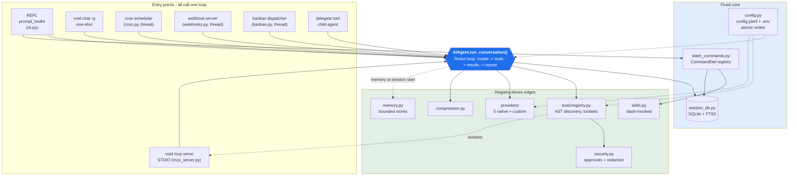

# void

A self-contained AI agent terminal harness. One process: an interactive REPL, a tool-calling
agent loop, session persistence, skills, cron, webhooks, a kanban dispatcher, and an MCP
server.

Direct model integration — the CLI holds the API keys and calls the provider itself.
No messaging gateway, no separate bot layer, no proxy.

```bash
pip install -r requirements.txt
python -m void setup model     # pick provider -> model, save the key, test the call
python -m void                 # interactive REPL
```

---

## Architecture: one loop, many entry points; registry at the edges, fixed in the middle

Every surface — REPL, `chat -q`, cron, webhooks, the kanban dispatcher, `delegate`, and MCP —
calls the same `AIAgent.run_conversation()`. Nothing else implements an agent.



**One loop.** `run_conversation()` lives in `void/agent/conversation_loop.py` and is bound to
`AIAgent` in `void/agent/run_agent.py`. It is synchronous; cron, webhooks, and the kanban
dispatcher run on separate threads.

**Registry at the edges, fixed in the middle.** Tools (`void/tools/*.py`), providers
(`void/providers/*.py`), and slash commands (`void/slash_commands.py`) are registries. The
agent loop, session DB, config system, and slash-command registry are fixed core.

**Opt-in context.** Skills are never auto-injected. `/skill-name` loads one into the system
prompt. Memory is loaded once at session start, bounded to ~800 (agent) + ~500 (user) tokens.

**Small system prompt.** Identity, tool names + one-line descriptions + schemas, memory,
resume context, and actively loaded skills. No skill dumps.

**Atomic writes everywhere.** Config, `.env`, checkpoint manifests, and skin files all use
temp-file + `os.replace`. The session DB uses SQLite transactions.

---

## Features

**Agent loop** — ReAct loop with configurable `max_iterations` (default 90), per-iteration
cancellation, budget tracking, and OpenAI-compatible message wire format.

**Providers** — OpenRouter (live `/v1/models`, cached fallback), Anthropic, OpenAI, Google
Gemini, and `custom` for any OpenAI-compatible endpoint (LM Studio, Ollama, vLLM, local).
Credential pools per provider: multiple keys, rotate on 401/rate-limit, skip exhausted keys.
Per-task auxiliary routing (`model.auxiliary.compression` / `.vision`) in `config.yaml`.

**CLI** — interactive REPL, `chat -q` one-shot, `chat --image` (vision), `--resume`,
`--continue`, `--worktree`, `--toolsets`, `--skills`, `--profile`, `--yolo`, `--safe-mode`.
Global flags parse before subcommand dispatch.

**REPL** — prompt_toolkit with history, autosuggest, slash-command tab completion, live
token streaming, `┊`-prefixed tool activity lines, Rich Markdown rendering, Ctrl+C to cancel
the current turn.

**Slash commands** — one `CommandDef` registry feeds `/help`, autocomplete, and dispatch:
`/model /tools /skills /memory /resume /rollback /yolo /spam /config /background /goal
/kanban /cron /webhook /checkpoint /xm /status /doctor /export /exit`.

**Tools** (19) — `terminal` (background processes + docker/ssh backends), `read_file`,
`write_file`, `edit_file`, `list_files`, `search_files` (sandboxed), `web_search` (Brave API
or keyless DuckDuckGo), `web_fetch`, `code_exec` (sandboxed child process with stdio RPC
tool access, 5 min / 50 calls), `delegate` (max depth 2), `memory`, `cron`, `webhook`,
`kanban_add/move/list`, `session_export/prune/stats`.

**Sessions** — SQLite (`~/.void/state.db`) with FTS5 full-text search. Every turn is persisted
before the response returns. `void sessions list|search|rename|delete|export|prune|stats`.

**Skills** — Markdown + YAML frontmatter, bundled in `skills/`, user-installed in
`~/.void/skills/`, plus git taps. Invoked by slash command, not auto-loaded. Bundles let one
alias (`/ship`) load several skills.

**Memory** — two bounded stores (agent notes ~800 tokens, user profile ~500), plain-text
backend behind a `read()`/`write()`/`clear()` interface.

**Context compression** — tracks real token usage; over threshold (default 85%), protects the
first 3 and last 4 turns and summarizes the middle with an auxiliary model.

**Checkpoints** — optional diff-based snapshots every N turns; `/rollback` restores.

**Cron & webhooks** — schedules accept `"every 30m"`, cron syntax (`*/2 * * * *`), and ISO
timestamps. `--no-agent` runs plain shell with zero LLM tokens. Webhook routes map HTTP paths
to agent turns.

**Kanban** — durable board (todo/in_progress/done) plus a dispatcher that spawns child agents.

**Profiles** — `~/.void/profiles/<name>/` with its own config, `.env`, DB, and skills.
`--clone` copies config; `--clone-all` copies everything.

**MCP server** — `void mcp serve` exposes the tool registry over STDIO JSON-RPC
(`initialize`, `tools/list`, `tools/call`).

**Security** — deny-list + heuristic dangerous-command detection with Y/n approval, `/yolo`
bypass, and secret redaction in UI output and logs.

**Skins, logging, doctor** — 4 built-in skins, per-element YAML overrides; logs in
`~/.void/logs/` with a separate `errors.log`; `void doctor` checks Python, SDKs, keys,
connectivity, disk, and config.

---

## Setup

```bash
pip install -r requirements.txt          # or: pip install -e .

# 1. configure interactively (model section is the one you need first)
python -m void setup model

# 2. try it
python -m void                            # REPL
python -m void chat -q "list the files here"
```

Or non-interactively:

```bash
python -m void config set model.provider openrouter
python -m void config set model.default anthropic/claude-3.5-sonnet
echo 'OPENROUTER_API_KEY=sk-or-...' >> ~/.void/.env
python -m void doctor                     # verifies the key with a real call
```

Secrets live in `~/.void/.env`; settings live in `~/.void/config.yaml` and never contain keys.

### Custom / local models

```bash
python -m void config set model.provider custom
python -m void config set model.custom.base_url http://localhost:11434/v1
python -m void config set model.default qwen2.5:32b
echo 'CUSTOM_API_KEY=none' >> ~/.void/.env   # 'none' = no auth
```

### MCP

```bash
python -m void mcp serve                  # STDIO; exposes all registry tools
```

---

## Configuration

`~/.void/config.yaml` (never secrets):

```yaml
model:
  provider: openrouter
  default: anthropic/claude-3.5-sonnet
  auxiliary:
    compression: { provider: custom, base_url: http://localhost:11434/v1, model: qwen2.5:32b }
    vision: { provider: google-gemini, model: gemini-2.5-flash }

toolsets:      { enabled: [all], disabled: [] }
security:
  approvals:   { enabled: true, yolo: false }
  redaction:   { enabled: true, patterns: [] }
sessions:
  auto_save: true
  checkpoint:  { enabled: false, interval: 5 }
compression:   { enabled: true, threshold: 0.85, context_window: 128000 }
cron:          { enabled: true, timezone: local }
webhook:       { host: 127.0.0.1, port: 8791 }
kanban:        { dispatcher: { enabled: false, max_concurrent: 2 } }
memory:        { enabled: true, agent_limit_tokens: 800, user_limit_tokens: 500, backend: file }
terminal:      { backend: local, project_dir: "", timeout: 120 }
display:       { compact: false, streaming: true, show_reasoning: false, skin: default }
```

`void config get/set/unset/show/check/migrate` — all writes atomic.

---

## Commands

```
void                     interactive REPL
void chat -q "…"          one-shot, prints only the final response
void model               provider → model picker
void setup [section]     wizard: model terminal tools security display memory compression
void config …            get/set/unset/show/check/migrate/edit
void tools               list toolsets and tools
void skills …            list browse search inspect install uninstall update tap
void sessions …          list search rename delete export prune stats
void cron …              create list edit run remove pause resume serve
void webhook …           subscribe list remove test serve
void kanban …            list add move clear-done stats run
void memory …            status setup off reset
void skin …              list use set show
void auth …              add remove list
void profile …           list create use show delete rename export import
void mcp …               serve add list remove
void logs [-f] [errors]
void doctor [--fix]
void status
void completion bash|zsh|fish
```

Global flags: `--profile --resume --continue --worktree --toolsets --skills --model --skin
--yolo --safe-mode --debug -V`.

---

## Layout

```
void/
├── main.py               arg parse + all subcommands
├── cli.py                HermesLiteCLI: REPL, slash dispatch, streaming render
├── config.py             config.yaml, .env, profiles, atomic writes
├── context.py            system prompt assembly (kept small)
├── state.py              RuntimeState: session, model, flags, cancellation
├── slash_commands.py     CommandDef registry (drives /help + autocomplete)
├── model_tools.py        ModelRouter: routing, key rotation, pickers
├── session_db.py         SQLite + FTS5, sessions/messages/cron/webhooks/kanban
├── memory.py             bounded agent + user memory stores
├── skills.py             frontmatter parsing, install/update/taps/bundles
├── cron.py               schedule parsing + threaded scheduler
├── webhooks.py           routes + HTTP receiver → agent turns
├── kanban.py             board + multi-agent dispatcher
├── compression.py        token tracking + summarization
├── checkpoints.py        diff-based snapshots + rollback
├── security.py           dangerous-command detection, redaction
├── skin.py               skins (default/dark/light/mono + user YAML)
├── doctor.py             health checks + status
├── profiles.py           profile CRUD
├── setup_wizard.py       section-re-runnable wizard
├── mcp_server.py         MCP STDIO server
├── logging_setup.py      file logs + tail
├── agent/
│   ├── run_agent.py        AIAgent (run_conversation attached here)
│   └── conversation_loop.py  the loop: model, tools, compression, checkpoints
├── tools/                 one file per tool, each calling registry.register()
├── providers/             base + openrouter/anthropic/openai/gemini/custom
skills/                    bundled skills + bundles.yaml
```

### Adding a tool

Drop a file in `void/tools/` that calls `registry.register(...)` at module top level:

```python
from .registry import get_context, registry

def my_tool_handler(args: dict) -> dict:
    ctx = get_context()
    return {"ok": True, "result": args}

registry.register(
    "my_tool",
    {"description": "What it does — the model reads this.",
     "parameters": {"type": "object",
                    "properties": {"x": {"type": "string"}},
                    "required": ["x"]}},
    my_tool_handler,
    toolset="terminal",
)
```

Discovery parses each file's AST and imports **only** files with a top-level `register(...)
call, so a half-written file or a helper module is never imported.

---

## Non-goals

No messaging gateway or platform adapters. No separate TUI, desktop app, or web dashboard.
No OAuth/device-code flows. No ACP server, no pet mascots, no production telemetry.

## License

MIT